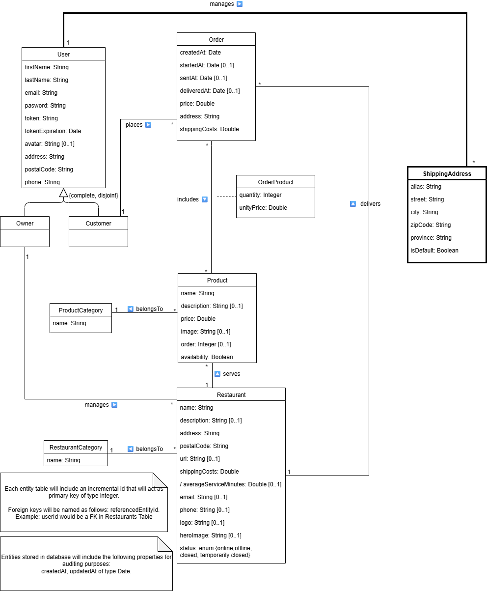

# Examen DeliverUS - Modelo A - Julio (Gestión de direcciones de envío)

Recuerde que DeliverUS está descrito en: <https://github.com/IISSI2-IS-2025>

## Enunciado del examen

Se ha incorporado un nuevo requisito en la aplicación **DeliverUS**, , que permite a los clientes gestionar **direcciones de envío**. Cada cliente podrá guardar múltiples direcciones, marcando una como predeterminada, y utilizar dichas direcciones en sus pedidos.

### ¿Qué son las Direcciones de envío?
En **DeliverUS**, las **direcciones de envío** representan los lugares a los que los clientes desean recibir sus pedidos. Se nos ha proporcionado el siguiente modelado conceptual:

Es necesaria la implementación de los siguientes requisitos funcionales:




### **RF1. Listado de direcciones de envío del cliente**

**Como** cliente,
**quiero** listar mis direcciones de envío,
**para** ver y gestionar los lugares de envío que tengo registrados.

**Ruta:** `GET /shippingaddresses`

**Pruebas de aceptación:**

- Devuelve un array con todas las direcciones del usuario autenticado.

    ```Javascript
    [
     {
        alias: 'Casa principal',
        street: 'Calle Falsa 123',
        city: 'Sevilla',
        zipCode: '41001',
        province: 'Sevilla',
        isDefault: true,        
        userId: 1,
        createdAt: new Date(),
        updatedAt: new Date()
      },
      {
        alias: 'Trabajo',
        street: 'Avenida de la Innovación 42',
        city: 'Sevilla',
        zipCode: '41020',
        province: 'Sevilla',
        isDefault: false,        
        userId: 1,
        createdAt: new Date(),
        updatedAt: new Date()
      }
]
    ```
- Devuelve código 401 si el usuario no está autenticado.

---

### **RF2. Creación de una nueva dirección**

**Como** cliente,
**quiero** crear una nueva dirección de envío,
**para** poder utilizarla en futuros pedidos.

**Ruta:** `POST /shippingaddresses`

**Pruebas de aceptación:**

- Devuelve código 401 si el usuario no está autenticado.
- Devuelve código 422 si falta algún campo obligatorio (alias, street, city, etc.).
- Si es la primera dirección del usuario, debe marcarse dicha dirección automáticamente como predeterminada.

---

### **RF3. Marcar una  dirección como predeterminada**

**Como** cliente,
**quiero** marcar una dirección de envío como predeterminada,
**para** que se seleccione automáticamente al hacer un pedido.

**Ruta:** `PATCH /shippingaddresses/:shippingAddressId/default`

**Pruebas de aceptación:**

- Devuelve código 401 si el usuario no está autenticado.
- Devuelve código 403 si la dirección no pertenece al usuario.
- La dirección indicada se marca como predeterminada y las demás se desmarcan.

---

### **RF4. Eliminación de una dirección**

**Como** cliente,
**quiero** poder eliminar una dirección de envío,
**para** mantener actualizada mi lista de direcciones de envío.

**Ruta:** `DELETE /shippingaddresses/:shippingAddressId`

**Pruebas de aceptación:**

- Devuelve código 401 si el usuario no está autenticado.
- Devuelve código 403 si la dirección no pertenece al usuario.

---

## Ejercicios

### 1. Migraciones, modelos y cambios necesarios (2 puntos)

Cree y modifique las migraciones necesarias para reflejar el modelo conceptual e implemente el modelo **ShippingAddress**.

Complete los ficheros:
- `/src/database/migrations/YYYYMMDDHHMMSS-create-shippingaddress.js`
- `/src/models/ShippingAddress.js`

---

### 2. Rutas de ShippingAddress (2 puntos)

Implemente las siguientes rutas:

- RF1: **GET** `/shippingaddresses`
- RF2: **POST** `/shippingaddresses`
- RF3: **PATCH** `/shippingaddresses/:shippingAddressId/default`
- RF4: **DELETE** `/shippingaddresses/:shippingAddressId`

Se le proporciona el fichero `/src/routes/ShippingAddressRoutes.js` para definir estas rutas y recuerde incorporar los middlewares necesarios en cada ruta.

Nota: en `ShippingAddressMiddleware.js` encontrará funciones que le pueden ser útiles para definir las rutas y completará su implementación en el ejercicio 5.

---

### 3. Validaciones para ShippingAddress (2 puntos)

Implemente las reglas de validación para la creación y la marcación como predeterminada.
Se le proporciona el fichero `/src/controllers/Validation/ShippingAddressValidation.js` para definir estas validaciones.

---

### 4. Controlador de ShippingAddress (2 puntos)

Implemente las funciones necesarias para RF1, RF2, RF3 y RF4.

Se le proporciona el fichero `/src/controllers/ShippingAddressController.js` para definir estas funciones.

---

### 5. Comprobaciones de seguridad y consistencia (2 puntos)

Implemente las comprobaciones necesarias para asegurar que un usuario no accede a direcciones de envío de otro.

Se le proporciona el fichero `/src/middlewares/AddressMiddleware.js` para definir esta lógica.

---


### Información adicional importante

- **Las rutas y validaciones deben respetarse exactamente como aquí se describen, ya que los tests automáticos se basan en estas especificaciones.**
- **No modificar los tests.** El fichero de test `/tests/e2e/shippingAddresses.test.js` se comprueban explícitamente las rutas, estructuras de datos, validaciones y asociaciones descritas anteriormente.

## Procedimiento de entrega

1. Borrar las carpetas **node_modules** de backend.
1. Crear un ZIP que incluya todo el proyecto. **Importante: Comprueba que el ZIP no es el mismo que te has descargado e incluye tu solución**
1. Avisa al profesor antes de entregar.
1. Cuando el profesor te dé el visto bueno, puedes subir el ZIP a la plataforma de Enseñanza Virtual. **Es muy importante esperar a que la plataforma te muestre un enlace al ZIP antes de pulsar el botón de enviar**. Se recomienda descargar ese ZIP para comprobar lo que se ha subido. Un vez realizada la comprobación, puedes enviar el examen.

## Preparación del entorno

### a) Windows

- Abra un terminal y ejecute el comando `npm run install:all:win`.

### b) Linux/MacOS

- Abra un terminal y ejecute el comando `npm run install:all:bash`.

## Ejecución

### Backend

- Para **rehacer las migraciones y seeders**, abra un terminal y ejecute el comando

    ```Bash
    npm run migrate:backend
    ```

- Para **ejecutarlo**, abra un terminal y ejecute el comando

    ```Bash
    npm run start:backend
    ```

## Depuración

- Para **depurar el backend**, asegúrese de que **NO** existe una instancia en ejecución, pulse en el botón `Run and Debug` de la barra lateral, seleccione `Debug Backend` en la lista desplegable, y pulse el botón de *Play*.

## Test

- Para comprobar el correcto funcionamiento de backend puede ejecutar el conjunto de tests incluido a tal efecto. Para ello ejecute el siguiente comando:

    ```Bash
    npm run test:backend
    ```

**Advertencia: Los tests no pueden ser modificados.**

## Problemas con los puertos

En ocasiones, los procesos de backend, con o sin depuración, puede quedarse bloqueado sin liberar los puertos utilizados, impidiendo que puedan ejecutarse otros procesos. Se recomienda cerrar y volver a iniciar VSC para cerrar dichos procesos.
